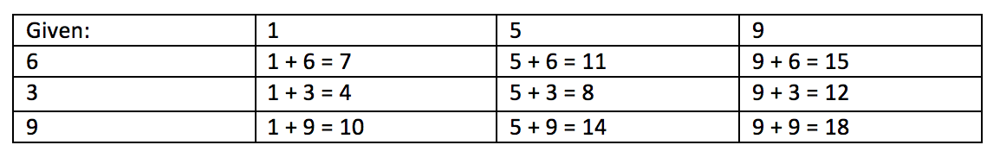
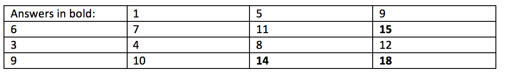

# Interview Problem

You are given two integer arrays of the same length, and you must find and return a list of the size of the given arrays, comprised of the largest possible sums in the array. Example: say you are given [1,5,9] and [6,3,9], all possible sums are:

The list of integers to be returned is: 14, 15, 18 in this case. After you have solved the problem you will need to answer these two additional questions:

1) How fast is your solution? (Big O notation)

2) What is the space complexity of your solution?

Context: You are coding on a Google document with a man with a heavy accent judging your every move. You have 45 minutes.

My solution was not good enough to land me the job, check out the MySolution class to see my answer to this problem. I haven't updated the speed of my solution or anything, I'm just showing what I did under pressure.

Unit tests are located in the Tests.java class.